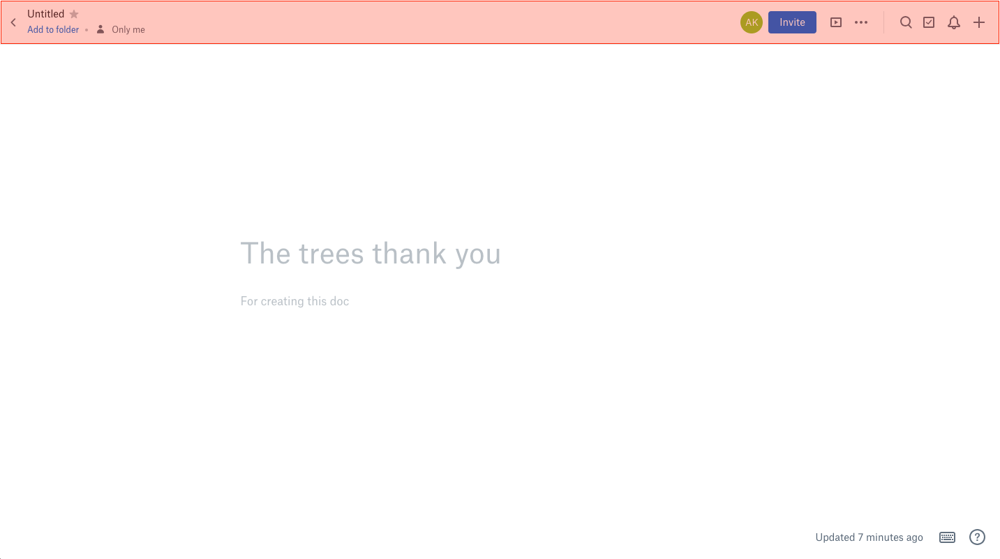

# Distraction-Free Dropbox Paper

I like Dropbox Paper's interface overall, but that header takes up precious vertical space. This browser extension hides Dropbox Paper's screen header for an even cleaner writing interface. Currently for Chrome.

Find it in Chrome Web Store: https://chrome.google.com/webstore/detail/distraction-free-dropbox/fnahmnjjgbdhbahinnjkjaonpemcijbc

To-do: cross-browser compatibility check

This browser extension was made for personal use. The icon is based on the Dropbox Paper Glyph, which belongs to Dropbox, Inc.