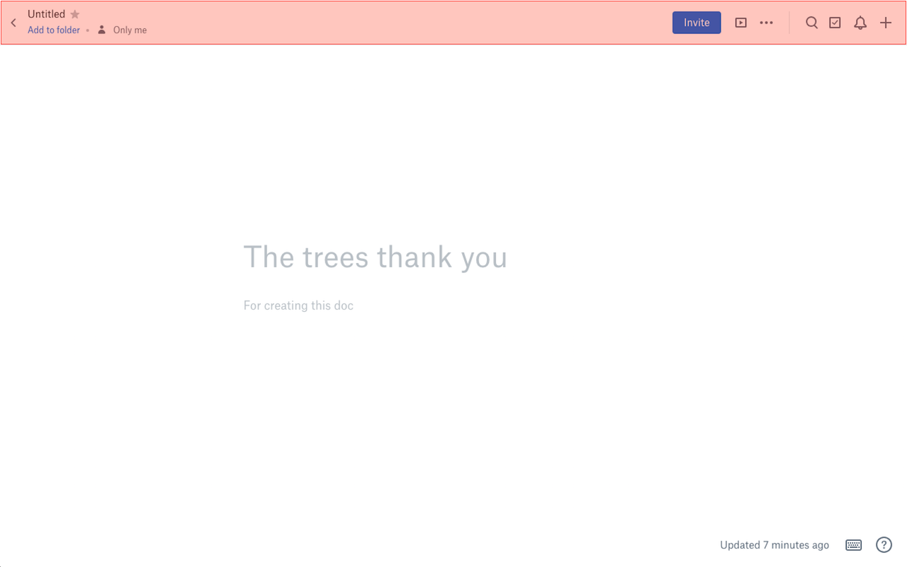

# Distraction-Free Dropbox Paper

I like Dropbox Paper's interface overall, but that header takes up precious vertical space. This browser extension hides Dropbox Paper's screen header for an even cleaner writing interface. 

Chrome extension: https://chrome.google.com/webstore/detail/distraction-free-dropbox/fnahmnjjgbdhbahinnjkjaonpemcijbc
Firefox add-on: https://addons.mozilla.org/en-US/firefox/addon/distraction-free-dropbox-paper/

This browser extension was made for personal use. The icon is based on the Dropbox Paper Glyph, which belongs to Dropbox, Inc.